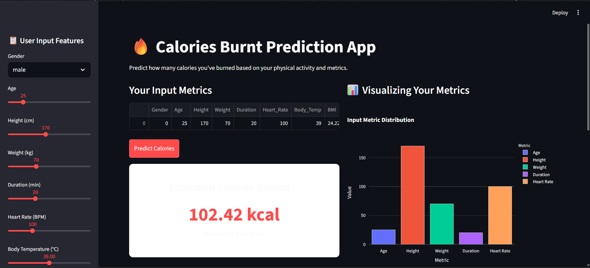
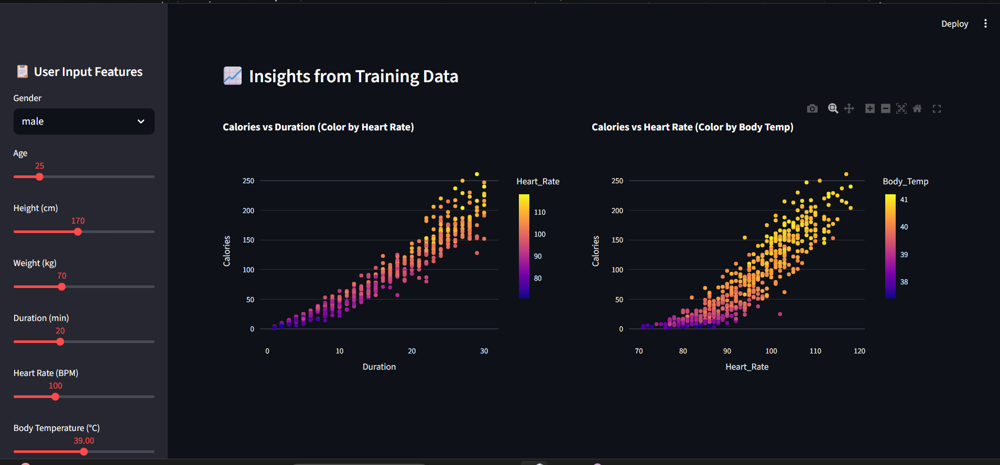

# 🔥AI-Based-Fitness-Calorie-Estimation-Prediction-System

An AI-powered fitness application that predicts the number of calories burned based on user physical metrics and activity data. Built using Machine Learning and deployed with an interactive Streamlit dashboard.

---

# Link of website -: https://bhavik-mittal-26-ai-based-fitness-calorie-estimation-app-2lkupk.streamlit.app/


## 🚀 Features

* 🔮 Predict calories burned using ML model (XGBoost)
* 📊 Interactive dashboard with real-time input
* 📈 Data visualizations using Plotly
* ⚙️ Feature engineering (BMI, Intensity Score, Metabolic Stress)
* 🧠 Pre-trained model integration using `.pkl` files
* 🎯 User-friendly UI with dynamic inputs

---

## 🧠 Machine Learning Pipeline

* Data Preprocessing (Handling features, encoding, scaling)
* Feature Engineering:

  * BMI
  * Intensity Score
  * Metabolic Stress
* Model Used:

  * XGBoost Regressor
* Model Evaluation:

  * RMSE, R² Score
* Hyperparameter tuning using RandomizedSearchCV

---

## 🛠️ Tech Stack

* Python 🐍
* Streamlit 🌐
* Scikit-learn
* XGBoost
* Pandas & NumPy
* Plotly

---

## 📸 Screenshots

### 🔹 Main Prediction Interface

![App Screenshot]


### 🔹 Data Insights Visualization

![Insights Screenshot]


---

## ⚙️ Installation & Setup

### 1️⃣ Clone the repository

```bash
git clone https://github.com/Bhavik-Mittal-26/AI-Based-Fitness-Calorie-Estimation-Prediction-System.git
cd AI-Based-Fitness-Calorie-Estimation-Prediction-System
```

### 2️⃣ Install dependencies

```bash
pip install -r requirements.txt
```

Or manually:

```bash
pip install streamlit pandas numpy scikit-learn xgboost plotly joblib
```

### 3️⃣ Run the app

```bash
streamlit run app.py
```

---

## 📂 Project Structure

```
├── app.py
├── train_assets.py
├── best_xgb_model.pkl
├── scaler.pkl
├── label_encoder.pkl
├── calories.csv
├── README.md
```

---

## 🎯 Use Case

This project can be used for:

* Fitness tracking applications
* Health analytics platforms
* Personalized workout planning
* Educational ML demonstrations

---

## 🔮 Future Improvements

* Add SHAP for model explainability
* Deploy on cloud (Streamlit Cloud / Render)
* Integrate wearable device data
* Add personalized fitness recommendations

---

## 👨‍💻 Author

**Bhavik Mittal**

---

## ⭐ If you like this project

Give it a star ⭐ on GitHub and share it!

---
